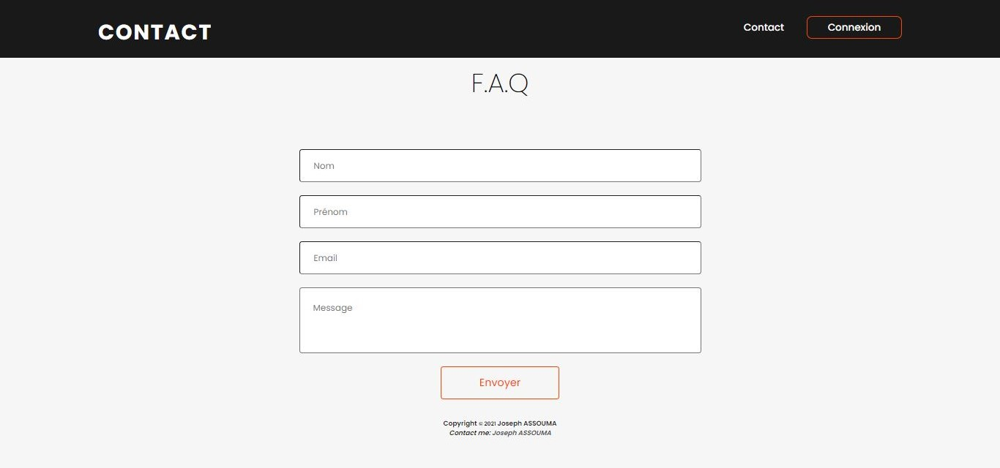
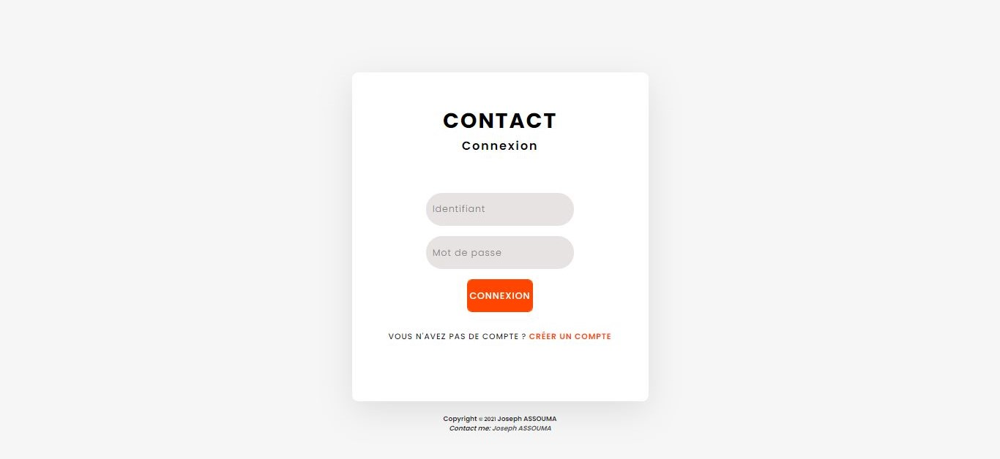
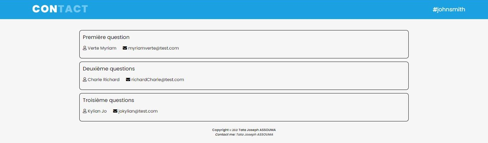

# ContactSimple

Projet visant à mettre en place un module de contact simple.

## Stack Technique

HTML, CSS, JavaScript, PHP, MySQL, Smarty

## Presentation du Projet

Le but de ce projet est de démontrer comment j'arrive à répondre à un problème en réalisant une application web.
Pour ce faire, j'ai mis mes notions de design, mes compétences des langages ainsi que des méthodes de conception d'un site internet que j'ai appris lors de ma formation .
J'ai développé 4 pages à savoir:

- La page index où l'internaute doit pouvoir saisir ses coordonnées et sa question. Il est composé de 4 champs,le nom, le prénom, l'email ainsi que le champ message.
  Cette page est reliée à la base de données pour pouvoir afficher les questions de l'internaute sur une page sécurisée.

- La page login où un utilisateur identifié et autorisé pourra saisir ses identifiants pour accéder à la page sécurisée.

- La page création de compte où un utilisateur pourra créer son compte afin d'accéder à la page sécurisée

- La page questionnaire où s'affichent toutes les questions ainsi que les coordonnées des internautes qui les ont posées.
  Cette page est uniquement accessible en étant un utilisateur identifié et autorisé.

Voici quelques screenshots du site:

    
    
    

